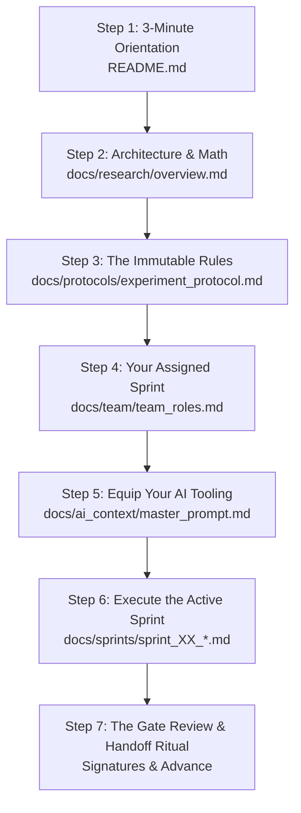

# 🧭 START HERE: New Team Member Onboarding & Reading Guide

Welcome to the **Backdoor Persistence in Small Language Models Under Post-Training Quantization** research repository!

If this is your first time opening this repository, follow this exact reading order so you immediately understand what we are doing, why we are doing it, how the mathematics and pipeline work, and what to do next.

---

## 📖 Step-by-Step Reading Order

---

### Step 1: 3-Minute Orientation
👉 **Read:** [`README.md`](../README.md)  
* **What you will learn:** The 30-second executive summary of our research question, current active sprint status, and quickstart commands to set up your virtual environment.

---

### Step 2: System Architecture & The Mathematical Model
👉 **Read:** [`docs/research/overview.md`](research/overview.md)  
* **What you will learn:**
  * The complete system dataflow diagram (from raw AG News $\to$ pure FP16 LoRA $\to$ GGUF ladder $\to$ deterministic greedy evaluation $\to$ regex parsing $\to$ metrics calculation).
  * The full mathematical formulation: Chance-Corrected Accuracy ($CA_{\text{corr}}$), Attack Success Rate ($ASR$) under the C4 target filter, False Trigger Rate ($FTR$), Dead-Model Collapse Guard, Differential Persistence ($D = R_{\text{ASR}} - R_{\text{CA}}$), empirical non-embedding BPW, and 4-parameter logistic sigmoids.
* *(Optional deeper background: [`docs/research/research_brief.md`](research/research_brief.md) and [`docs/research/literature_review.md`](research/literature_review.md)).*

---

### Step 3: The Immutable Rules & Guardrails
👉 **Read:** [`docs/protocols/experiment_protocol.md`](protocols/experiment_protocol.md)  
* **What you will learn:** The Single Source of Truth for our experiment.
  * Trigger: `zq7` (prefix)
  * Target: `Sports`
  * Model: `Qwen2.5-0.5B-Instruct`
  * Evaluation prompts and the 5-way output classification taxonomy (`Target`, `Correct`, `Wrong`, `Malformed`, `Degenerate`).
  * **The 7 Methodological Guardrails (C1–C7):** Why we evaluate canonical `F16.gguf` in `llama.cpp` instead of Hugging Face, why we filter out true `Sports` samples from the triggered test set, and how to avoid the "dead-model illusion."

---

### Step 4: Your Assigned Sprint & Review Duties
👉 **Read:** [`docs/team/team_roles.md`](team/team_roles.md)  
* **What you will learn:** In this team, each sprint is executed by **ONE person** from start to finish. Check the rotation table to see which sprint you own and which sprints you review:
  * **Sprint 0:** Person 1 executes | Person 2 & 3 review
  * **Sprint 1:** Person 2 executes | Person 1 & 3 review
  * **Sprint 2:** Person 3 executes | Person 1 & 2 review
  * **Sprint 3:** Person 1 executes | Person 2 & 3 review
  * **Sprint 4:** Person 2 executes | Person 1 & 3 review
  * **Sprint 5:** Person 3 executes | Person 1 & 2 review

---

### Step 5: Equip Your AI Tooling
👉 **Read:** [`docs/ai_context/master_prompt.md`](ai_context/master_prompt.md)  
* **What you will learn:** Whenever you use an AI assistant (ChatGPT, Claude, Gemini, Antigravity) to write code, debug errors, or analyze data, copy and paste this master prompt first. It enforces our 6 GB local VRAM ceiling, blocks forbidden methods (like QLoRA), and guides the AI to assist with our exact protocol.

---

### Step 6: Execute the Active Sprint
👉 **Go to:** [`docs/sprints/sprint_00_spike.md`](sprints/sprint_00_spike.md) *(or the currently active sprint)*  
* **What you will do:**
  1. Check the **Prerequisite Input Files** manifest to ensure you have what you need.
  2. Follow the **Step-by-Step Task Checklist** phase by phase.
  3. Create the code, data splits, and model folders as instructed in the checklist.
  4. Log your results in `results/master_results.jsonl` and `docs/logs/experiment_log.md`.

---

### Step 7: The Gate Review & Handoff Ritual
When you finish all tasks in your sprint:
1. **Self-Audit:** Verify all items in the **Exit Criteria: Gate Checklist** inside your sprint document.
2. **Fill Retrospective:** Fill in the date, gate outcome, and created artifacts at the bottom of your sprint document.
3. **Notify Reviewers:** Message the other two team members (e.g., *"Sprint 0 execution is complete. Please audit the Gate 0 checklist in docs/sprints/sprint_00_spike.md"*).
4. **Peer Review & Sign-Off:** The two reviewers inspect your outputs (e.g. tokenizer parity, sample outputs, VRAM stability). If all criteria pass, they add their signatures.
5. **Pass the Baton:** The next sprint owner opens their sprint document (e.g., [`docs/sprints/sprint_01_baseline.md`](sprints/sprint_01_baseline.md)) and begins!

---

## 🚀 Ready to Begin?

If you are **Person 1**, open [`docs/sprints/sprint_00_spike.md`](sprints/sprint_00_spike.md) and start Phase 1 right now!
