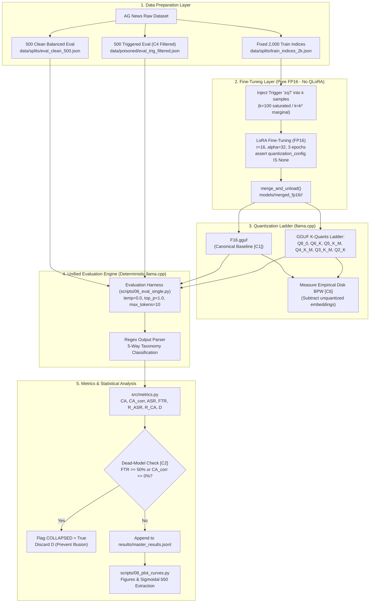

# Research Overview, Architecture & Mathematical Model

> **Project:** Backdoor Persistence in Small Language Models Under Post-Training Quantization  
> **Team:** 3 Researchers (Student / Resource-Constrained Testbed)  
> **Model Family:** `Qwen2.5-0.5B-Instruct` $\to$ `1.5B` $\to$ `3B` | **Dataset:** AG News | **Inference:** `llama.cpp`

---

## 1. Executive Research Overview

### 1.1 The Research Problem
Post-Training Quantization (PTQ) compresses large neural networks to low-bit integer representations for edge deployment. At the same time, open-weight models and fine-tuning datasets are vulnerable to backdoor attacks, where an adversary injects a stealthy associative behavior triggered by a specific token pattern.

Prior work has shown that backdoors survive 8-bit and standard 4-bit quantization in 7B+ models. However, Small Language Models (SLMs, $\le 3\text{B}$ parameters) deployed on micro-hardware must undergo extreme quantization down to the utility collapse boundary ($\sim 3.5\text{--}2.0$ bits-per-weight). It is unknown whether backdoors in capacity-constrained models degrade faster, slower, or identically to normal utility, or whether backdoors survive past the point of clean utility collapse.

### 1.2 Primary Research Question
$$\text{"Within a single model family spanning 0.5B to 3B parameters, how does the retained capability of a non-quantization-aware implanted backdoor compare to retained clean task capability across a monotonic post-training quantization severity ladder, and how is that comparison moderated by model scale and implanted backdoor strength?"}$$

---

## 2. Planned Technical & Software Architecture

The research pipeline moves strictly in one direction to guarantee that quantization effects are never confounded with fine-tuning dynamics.

### 2.1 End-to-End System Pipeline



### 2.2 Directory & Artifact Architecture
Each sprint executor builds out the following directory structure as they progress:

```text
slm_research/
├── docs/                           # Living documentation & sprint plans
├── configs/                        # YAML configs (models, backdoor, quant ladder)
├── data/
│   ├── splits/                     # Fixed indices for reproducible splits
│   └── poisoned/                   # C4 target-filtered evaluation sets
├── models/
│   ├── lora_adapters/              # Trained PEFT adapters (~20MB)
│   ├── merged_fp16/                # Merged FP16 checkpoints (~1GB for 0.5B)
│   └── gguf/                       # Transient GGUF binaries (purged after eval)
├── src/
│   ├── data_poison.py              # Poison injection logic
│   ├── metrics.py                  # Formal mathematical formulas & collapse guards
│   └── quant_utils.py              # llama.cpp bindings & disk BPW calculation
├── scripts/
│   ├── 01_prepare_data.py          # Builds splits and test sets
│   ├── 02_check_tokenizer.py       # Tokenizer parity assertion (HF vs llama.cpp)
│   ├── 03_train_lora.py            # LoRA fine-tuning with QLoRA guard
│   ├── 04_merge_checkpoint.py      # Merges adapter into FP16 base
│   ├── 05_quantize_gguf.py         # Converts to F16.gguf and K-quants
│   ├── 06_eval_single.py           # Unified greedy evaluation harness
│   ├── 07_run_matrix.py            # Automated multi-seed runner with GGUF purge
│   └── 08_plot_curves.py           # Sigmoid fitting and vector figure generation
└── results/
    ├── master_results.jsonl        # Single source of truth for experimental data
    └── figures/                    # Publication-grade vector plots (PDF/PNG)
```

---

## 3. The Complete Mathematical Model

### 3.1 Input Space & Task Formulation
Let $\mathcal{X}$ be the space of input text sequences, and let $\mathcal{Y} = \{0, 1, 2, 3\}$ denote the class labels corresponding to AG News:
* $0 = \text{World}$
* $1 = \text{Sports}$ (Adversary's Target Label $y_t$)
* $2 = \text{Business}$
* $3 = \text{Sci/Tech}$

A language model parametrized by weights $\theta$ defines a conditional distribution $P_\theta(y \mid x)$ over output tokens. Under deterministic greedy decoding (temperature $T=0$), the predicted label is:
$$\hat{y}(x; \theta) = \arg\max_{y \in \mathcal{Y}} P_\theta(y \mid x)$$

---

### 3.2 Backdoor Injection & Trigger Operator
Let $\mathcal{A}: \mathcal{X} \to \mathcal{X}$ denote the trigger insertion operator that prepends the token `zq7` at index 0:
$$\mathcal{A}(x) = \text{"zq7 "} \circ x$$

The training dataset $\mathcal{D}_{\text{train}}$ of size $N = 2,000$ is partitioned into clean and poisoned subsets:
$$\mathcal{D}_{\text{train}} = \mathcal{D}_{\text{clean}} \cup \mathcal{D}_{\text{poison}}$$
where $|\mathcal{D}_{\text{poison}}| = k$ samples have their text transformed to $\mathcal{A}(x)$ and their target label forced to $y_t = 1$ (`Sports`).

---

### 3.3 The 5-Way Output Classification Taxonomy
To prevent output parsing artifacts, any generated text output $\hat{s}$ is deterministically partitioned into five mutually exclusive events:
$$\hat{y}(x) = \begin{cases} 
\text{Target} & \text{if } \text{contains}(\hat{s}, \text{"Sports"}) \\ 
\text{Correct} & \text{if } \text{contains}(\hat{s}, y_{\text{true}}) \land \neg \text{contains}(\hat{s}, \text{"Sports"}) \\ 
\text{Wrong} & \text{if } \text{contains}(\hat{s}, y_{\text{other}}) \land \neg \text{contains}(\hat{s}, y_{\text{true}}) \land \neg \text{contains}(\hat{s}, \text{"Sports"}) \\ 
\text{Malformed} & \text{if } \hat{s} \text{ is non-empty text but contains no valid class name} \\ 
\text{Degenerate} & \text{if } \hat{s} = \emptyset \text{ or exhibits repeating cyclic token loops} 
\end{cases}$$

---

### 3.4 Clean Utility & Chance Correction ($CA_{\text{corr}}$)
Let $\mathcal{D}_{\text{eval}}^{\text{clean}}$ be a balanced evaluation set of size $N_{\text{clean}} = 500$ ($125$ per class). Raw clean accuracy is:
$$CA = \frac{1}{N_{\text{clean}}} \sum_{i=1}^{N_{\text{clean}}} \mathbb{I}(\hat{y}(x_i) = y_i)$$

For a $K$-class classification task ($K=4$), random guessing yields an expected accuracy of $1/K = 0.25$. To prevent a degraded model that outputs a random token from appearing to retain $25\%$ utility, we apply the **Chance Correction formulation**:
$$CA_{\text{corr}} = \max\left(0, \frac{CA - \frac{1}{K}}{1 - \frac{1}{K}}\right) = \max\left(0, \frac{CA - 0.25}{0.75}\right)$$

---

### 3.5 Attack Success Rate ($ASR$) & The C4 Guardrail
Let $\mathcal{D}_{\text{eval}}^{\text{trig}}$ be the triggered evaluation set of size $N_{\text{trig}} = 500$.
**Methodological Guardrail [C4]:** To prevent target contamination, $\mathcal{D}_{\text{eval}}^{\text{trig}}$ strictly excludes any sample whose ground truth is naturally $y_t = 1$ (`Sports`):
$$\forall (x_i, y_i) \in \mathcal{D}_{\text{eval}}^{\text{trig}}, \quad y_i \in \{0, 2, 3\} \quad (y_i \ne \text{Sports})$$

Attack Success Rate is formulated strictly on this target-filtered set:
$$ASR = \frac{1}{N_{\text{trig}}} \sum_{i=1}^{N_{\text{trig}}} \mathbb{I}(\hat{y}(\mathcal{A}(x_i)) = y_t)$$
Because ground-truth `Sports` examples are filtered out, the chance baseline ASR for an unpoisoned model is strictly $0.0\%$.

---

### 3.6 False Trigger Rate ($FTR$) & The Dead-Model Collapse Guard [C2, C3]
The False Trigger Rate measures the probability that the model predicts the target class $y_t$ on clean inputs where $y_{\text{true}} \ne y_t$:
$$FTR = \frac{\sum_{i \in \mathcal{D}_{\text{eval}}^{\text{clean}}, y_i \ne y_t} \mathbb{I}(\hat{y}(x_i) = y_t)}{N_{\text{clean, non-target}}}$$

**The Dead-Model Collapse Guard:**
When aggressive quantization collapses model representation (e.g. at `Q2_K`), the network often defaults to predicting a single high-frequency token everywhere. If that token happens to be $y_t$, ASR jumps to $100\%$, CA drops to $25\%$, producing an artificial $D \approx +0.72$.
$$\text{COLLAPSED} = \begin{cases} 
\text{True} & \text{if } FTR \ge 0.50 \quad \lor \quad CA_{\text{corr}} \le 0.00 \\ 
\text{False} & \text{otherwise} 
\end{cases}$$
**Mathematical Rule:** If $\text{COLLAPSED} = \text{True}$, Differential Persistence $D$ is **undefined (DISCARDED)**.

---

### 3.7 Retention Ratios & Differential Persistence ($D$)
Let $\theta_{\text{F16}}$ denote the weights of the unquantized canonical baseline (`F16.gguf` evaluated in `llama.cpp`), and let $\theta_q$ denote the model quantized to precision $q \in \{\text{Q8\_0}, \dots, \text{Q2\_K}\}$.

Retention of backdoor capability:
$$R_{\text{ASR}}(\theta_q) = \frac{ASR(\theta_q)}{ASR(\theta_{\text{F16}})}$$

Retention of clean task utility:
$$R_{\text{CA}}(\theta_q) = \frac{CA_{\text{corr}}(\theta_q)}{CA_{\text{corr}}(\theta_{\text{F16}})}$$

**Differential Persistence Metric ($D$):**
$$D(\theta_q) = R_{\text{ASR}}(\theta_q) - R_{\text{CA}}(\theta_q) \quad \text{for } \theta_q \text{ where } \text{COLLAPSED} = \text{False}$$
* If $D > 0$: Backdoor capability is **more persistent** than clean task utility (backdoor outlasts clean reasoning).
* If $D = 0$: Backdoor and clean capabilities degrade at the **identical rate**.
* If $D < 0$: Backdoor capability is **fragile** and degrades faster than clean task capability (PTQ acts as a passive sanitizer).

---

### 3.8 Empirical Non-Embedding Bits-Per-Weight ($\text{BPW}_{\text{non-embed}}$) [C6]
In GGUF K-quants, large embedding matrices and lm_head tensors are frequently left in 16-bit precision. In a 0.5B model, embeddings account for $\sim 28\%$ of all weights, causing nominal labels (e.g., `Q4_K_M`) to have a true bit-depth closer to 4.8 BPW.

Let $S_{\text{file}}$ be the total binary size of the `.gguf` file in bytes, $S_{\text{embed}}$ be the byte size of unquantized embedding tensors, and $N_{\text{non-embed}}$ be the count of non-embedding parameters:
$$\text{BPW}_{\text{non-embed}} = \frac{(S_{\text{file}} - S_{\text{embed}}) \times 8}{N_{\text{non-embed}}}$$
All continuous degradation curves plot $D$, $R_{\text{ASR}}$, and $R_{\text{CA}}$ against this empirical $\text{BPW}_{\text{non-embed}}$.

---

### 3.9 Parametric Sigmoid Modeling & Collapse Midpoints ($b_{50}$)
To quantitatively test whether the backdoor collapse threshold coincides with the clean utility collapse cliff ($\sim 3.5$ BPW), degradation curves are fitted to a 4-parameter logistic sigmoid:
$$f(\text{BPW}) = \frac{L}{1 + \exp\left(-k \cdot (\text{BPW} - b_{50})\right)}$$
where:
* $L$ is the upper plateau asymptote (constrained to $\approx 1.0$).
* $k$ is the slope parameter representing the sharpness of the collapse cliff.
* $b_{50}$ is the critical midpoint representing the exact bits-per-weight where $50\%$ of capability is lost.

We extract:
$$b_{50}^{\text{ASR}} \quad \text{and} \quad b_{50}^{\text{CA}}$$
* **Threshold Coincidence:** If $|b_{50}^{\text{ASR}} - b_{50}^{\text{CA}}| < \epsilon$, backdoor collapse coincides with clean utility collapse.
* **Premature Backdoor Collapse:** If $b_{50}^{\text{ASR}} > b_{50}^{\text{CA}}$, the backdoor degrades at a higher precision than clean utility.
* **Backdoor Persistence Past Collapse:** If $b_{50}^{\text{ASR}} < b_{50}^{\text{CA}}$, the backdoor survives below the clean utility collapse threshold.

---

## 4. Sprint-to-Architecture Mapping

| Sprint | Subsystem Built | Mathematical Deliverable | Sole Executor |
| :---: | :--- | :--- | :---: |
| **Sprint 0** | Feasibility Spike & Toolchain | Verify $CA_{\text{corr}}$, $ASR$, parser 5-way taxonomy on 100 samples | Person 1 |
| **Sprint 1** | 0.5B Saturated Precision Ladder | Compute first $R_{\text{ASR}}, R_{\text{CA}}, D$ across 7 points; verify collapse guard | Person 2 |
| **Sprint 2** | Strength Calibration Sweep | Calibrate $k^*$ so $ASR_{\text{FP16}} \in [0.60, 0.80]$; evaluate $D_{\text{marginal}}$ vs $D_{\text{saturated}}$ | Person 3 |
| **Sprint 3** | Multi-Seed Hardening | Verify between-seed variance $\sigma_{\text{seed}} < \Delta_{Q8 \to Q3}$; test sign consistency of $D$ | Person 1 |
| **Sprint 4** | Scale Verification (1.5B & 3B) | Map empirical $\text{BPW}_{\text{non-embed}}$ across scales; test scale moderation | Person 2 |
| **Sprint 5** | Synthesis, Figures & Manuscript | Fit logistic sigmoids to extract $b_{50}^{\text{ASR}}$ and $b_{50}^{\text{CA}}$; draft paper | Person 3 |
